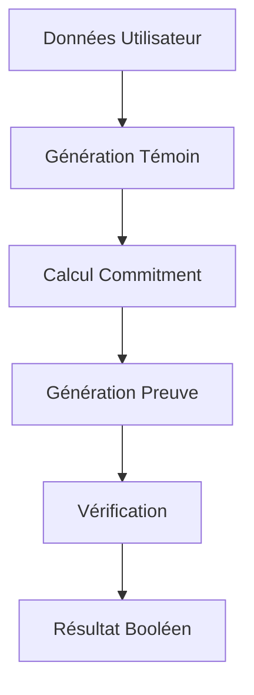

# 🔐 Système de Vérification de Permis Zero-Knowledge

Un système complet de vérification d'identité utilisant les zk-SNARKs pour prouver qu'une personne possède un permis de conduire de type 'A' sans révéler d'autres informations personnelles.

## 📋 Table des Matières

- [Vue d'ensemble](#vue-densemble)
- [Installation](#installation)
- [Structure du Projet](#structure-du-projet)
- [Utilisation](#utilisation)
- [Architecture Technique](#architecture-technique)
- [API Documentation](#api-documentation)
- [Exemples](#exemples)
- [Sécurité](#sécurité)
- [Contribution](#contribution)

## 🎯 Vue d'ensemble

Ce système permet de :
- **Prouver** qu'une personne possède un permis de type 'A'
- **Vérifier** cette preuve sans révéler d'informations sensibles
- **Maintenir la confidentialité** des données personnelles
- **Garantir l'intégrité** grâce aux zk-SNARKs

### Données Publiques vs Privées

**Publiques** (visibles par tous) :
- Nom
- Prénom  
- Hash de commitment

**Privées** (jamais révélées) :
- Date de naissance
- Type de permis
- Date d'expiration
- Nonce (pour l'unicité)

## 🚀 Installation

### Prérequis

```bash
# Node.js (version 16 ou supérieure)
node --version

# Circom compiler
npm install -g circom

# Git
git --version
```

### Installation rapide

```bash
# 1. Cloner ou créer le projet
mkdir zk-license-verification
cd zk-license-verification

# 2. Copier les fichiers du système
# (Copier tous les fichiers fournis dans ce répertoire)

# 3. Rendre le script de setup exécutable
chmod +x setup.sh

# 4. Exécuter le setup complet
./setup.sh
```

### Installation manuelle

```bash
# 1. Installer les dépendances
npm install snarkjs circomlib ffjavascript

# 2. Compiler le circuit
circom proof_of_license.circom --r1cs --wasm --sym -o build/

# 3. Effectuer le trusted setup
# (Voir setup.sh pour les détails)
```

## 📁 Structure du Projet

```
zk-license-verification/
├── proof_of_license.circom      # Circuit principal
├── license_verification.js      # Système principal
├── witness_generator.js         # Générateur de témoins
├── proof_verifier.js           # Vérificateur standalone
├── setup.sh                    # Script de configuration
├── test_verification.js        # Tests
├── package.json                # Configuration npm
├── README.md                   # Cette documentation
├── build/                      # Fichiers compilés
│   ├── proof_of_license.r1cs
│   ├── proof_of_license.wasm
│   └── proof_of_license_js/
├── proof_of_license.wasm       # Circuit WebAssembly
├── proof_of_license_final.zkey # Clé de proving
└── verification_key.json      # Clé de vérification
```

## 🔧 Utilisation

### Utilisation Basique

```bash
# Démonstration complète
npm run demo

# Tests approfondis
npm test

# Vérification de preuves existantes
node proof_verifier.js
```

### Utilisation Programmatique

#### Générer une Preuve

```javascript
const { LicenseVerificationSystem } = require('./license_verification.js');

async function generateProof() {
    const system = new LicenseVerificationSystem();
    await system.initialize();
    
    const userData = {
        name: 'Jean',
        surname: 'Durand',
        birthDate: '2000-01-01',
        license: 'A',
        expDate: '2026-01-01'
    };
    
    const proofData = await system.generateProof(userData);
    console.log('Preuve générée:', proofData);
}
```

#### Vérifier une Preuve

```javascript
const { ProofVerifier } = require('./proof_verifier.js');

async function verifyProof() {
    const verifier = new ProofVerifier();
    await verifier.initialize();
    
    const result = await verifier.verifyProofFromFile('./generated_proof.json');
    console.log('Résultat de vérification:', result);
}
```

#### Générer des Témoins

```javascript
const WitnessGenerator = require('./witness_generator.js');

const userData = {
    name: 'Marie',
    surname: 'Martin',
    birthDate: '1995-05-15',
    license: 'A',
    expDate: '2025-12-31'
};

const witness = WitnessGenerator.generateWitness(userData);
WitnessGenerator.saveWitness(witness, 'my_witness.json');
```

## 🏗️ Architecture Technique

### Circuit Circom

Le circuit `ProofOfLicense` effectue les opérations suivantes :

1. **Concaténation** : Assemble toutes les données (nom + prénom + date naissance + permis + date expiration + nonce)
2. **Hachage SHA256** : Calcule le hash des données concaténées
3. **Vérification** : Compare avec le commitment public
4. **Contrainte ZK** : Vérifie que le permis est de type 'A' (ASCII 65)

### Flux de Données



### Sécurité Cryptographique

- **Hash SHA256** : Garantit l'intégrité des données
- **zk-SNARKs Groth16** : Preuve zero-knowledge
- **Nonce** : Évite les attaques par rejeu
- **Trusted Setup** : Cérémonie Powers of Tau

## 📚 API Documentation

### LicenseVerificationSystem

#### `constructor()`
Crée une nouvelle instance du système.

#### `async initialize()`
Initialise le système en chargeant les clés.

#### `async generateProof(userData)`
Génère une preuve ZK.

**Paramètres :**
- `userData.name` (string) : Nom (max 64 caractères)
- `userData.surname` (string) : Prénom (max 64 caractères)  
- `userData.birthDate` (string) : Date naissance (YYYY-MM-DD)
- `userData.license` (string) : Type permis (1 caractère)
- `userData.expDate` (string) : Date expiration (YYYY-MM-DD)
- `userData.nonce` (string, optional) : Nonce (auto-généré si absent)

**Retour :**
```javascript
{
    proof: Object,           // Preuve zk-SNARK
    publicSignals: Array,    // Signaux publics
    commitment: string,      // Hash commitment
    nonce: string           // Nonce utilisé
}
```

#### `async verifyProof(proof, publicSignals)`
Vérifie une preuve ZK.

**Retour :** `boolean`

### WitnessGenerator

#### `static generateWitness(userData)`
Génère un témoin pour le circuit.

#### `static saveWitness(witness, filename)`
Sauvegarde un témoin en JSON.

#### `static loadWitness(filename)`
Charge un témoin depuis JSON.

#### `static validateWitness(witness)`
Vérifie la cohérence d'un témoin.

### ProofVerifier

#### `async initialize()`
Initialise le vérificateur.

#### `async verifyProof(proof, publicSignals)`
Vérifie une preuve.

#### `async verifyProofFromFile(filePath)`
Vérifie une preuve depuis un fichier.

#### `async batchVerify(proofs)`
Vérifie plusieurs preuves en lot.

## 🧪 Exemples

### Exemple Complet

```javascript
const { LicenseVerificationSystem } = require('./license_verification.js');

async function exempleComplet() {
    // 1. Initialisation
    const system = new LicenseVerificationSystem();
    await system.initialize();
    
    // 2. Données utilisateur
    const user = {
        name: 'Alice',
        surname: 'Wonderland',
        birthDate: '1990-12-25',
        license: 'A',
        expDate: '2025-12-25'
    };
    
    // 3. Génération preuve
    console.log('Génération de la preuve...');
    const proofData = await system.generateProof(user);
    
    // 4. Vérification
    console.log('Vérification de la preuve...');
    const isValid = await system.verifyProof(
        proofData.proof, 
        proofData.publicSignals
    );
    
    console.log('Preuve valide :', isValid);
    
    // 5. Informations publiques uniquement
    console.log('Informations publiques :');
    console.log('- Nom :', user.name);
    console.log('- Prénom :', user.surname);
    console.log('- Commitment :', proofData.commitment);
    console.log('- Possède permis A :', isValid);
}

exempleComplet().catch(console.error);
```

### Test avec Permis Invalide

```javascript
async function testPermisInvalide() {
    const system = new LicenseVerificationSystem();
    await system.initialize();
    
    const userWithBLicense = {
        name: 'Bob',
        surname: 'Builder',
        birthDate: '1985-06-15',
        license: 'B',  // Permis B au lieu de A
        expDate: '2026-06-15'
    };
    
    try {
        // Ceci devrait échouer car le circuit n'accepte que les permis 'A'
        const proofData = await system.generateProof(userWithBLicense);
        console.log('❌ Le circuit aurait dû rejeter le permis B');
    } catch (error) {
        console.log('✅ Erreur attendue pour permis B :', error.message);
    }
}
```

## 🔒 Sécurité

### Considérations de Sécurité

1. **Trusted Setup** : La cérémonie Powers of Tau doit être fiable
2. **Clés Privées** : Les paramètres secrets du setup doivent être détruits
3. **Nonce** : Essentiel pour éviter les attaques par rejeu
4. **Validation** : Toujours valider les entrées utilisateur

### Limitations

- Les preuves sont liées à un circuit spécifique
- Le trusted setup est critique pour la sécurité
- Les performances dépendent de la complexité du circuit

### Bonnes Pratiques

```javascript
// ✅ Bon : Validation des données
function validateUserData(userData) {
    if (!userData.name || userData.name.length > 64) {
        throw new Error('Nom invalide');
    }
    // Plus de validations...
}

// ✅ Bon : Gestion des erreurs
async function safeProofGeneration(userData) {
    try {
        validateUserData(userData);
        return await system.generateProof(userData);
    } catch (error) {
        console.error('Erreur sécurisée :', error.message);
        return null;
    }
}

// ❌ Mauvais : Exposer des informations sensibles
function badExample(userData) {
    console.log('Données privées :', userData.birthDate); // Ne pas faire !
}
```

## 🧪 Tests

### Exécuter les Tests

```bash
# Tests complets
npm test

# Tests spécifiques
node test_verification.js

# Tests de performance
node -e "
const { LicenseVerificationSystem } = require('./license_verification.js');
// Code de test de performance...
"
```

### Tests Manuels

```bash
# Générer des témoins de test
node witness_generator.js

# Vérifier des preuves existantes
node proof_verifier.js

# Test avec différents utilisateurs
node -e "
const { createTestUser } = require('./license_verification.js');
console.log(createTestUser('Test', 'User', '2000-01-01', 'A', '2025-01-01'));
"
```

## 🔧 Dépannage

### Problèmes Courants

**Erreur : "circom not found"**
```bash
npm install -g circom
```

**Erreur : "Circuit compilation failed"**
```bash
# Vérifier la syntaxe du circuit
circom proof_of_license.circom --r1cs --wasm --sym
```

**Erreur : "Verification key not found"**
```bash
# Refaire le trusted setup
./setup.sh
```

**Erreur de mémoire lors du setup**
```bash
# Augmenter la mémoire Node.js
export NODE_OPTIONS="--max-old-space-size=8192"
./setup.sh
```

### Debug

```javascript
// Activer les logs détaillés
process.env.DEBUG = 'snarkjs:*';

// Vérifier les témoins
const WitnessGenerator = require('./witness_generator.js');
const witness = WitnessGenerator.loadWitness('witness.json');
WitnessGenerator.displayWitness(witness);
```

## 🤝 Contribution

### Développement

```bash
# Fork du projet
git clone <your-fork>
cd zk-license-verification

# Installation dev
npm install
./setup.sh

# Tests avant commit
npm test
```

### Guidelines

1. **Code Style** : Utiliser des noms de variables explicites
2. **Tests** : Ajouter des tests pour toute nouvelle fonctionnalité
3. **Documentation** : Documenter les nouvelles API
4. **Sécurité** : Auditer les changements liés à la cryptographie

## 📄 Licence

MIT License - voir le fichier LICENSE pour les détails.

## 🙏 Remerciements

- [Circom](https://github.com/iden3/circom) pour le langage de circuit
- [SnarkJS](https://github.com/iden3/snarkjs) pour l'implémentation zk-SNARKs
- [Circomlib](https://github.com/iden3/circomlib) pour les composants cryptographiques

---

**⚠️ Avertissement** : Ce système est fourni à des fins éducatives et de démonstration. Pour un usage en production, un audit de sécurité complet est recommandé.
